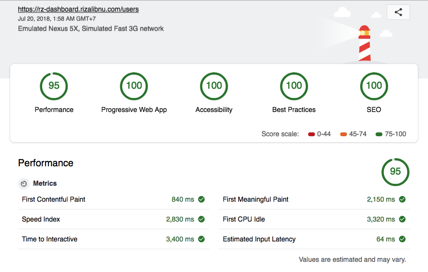
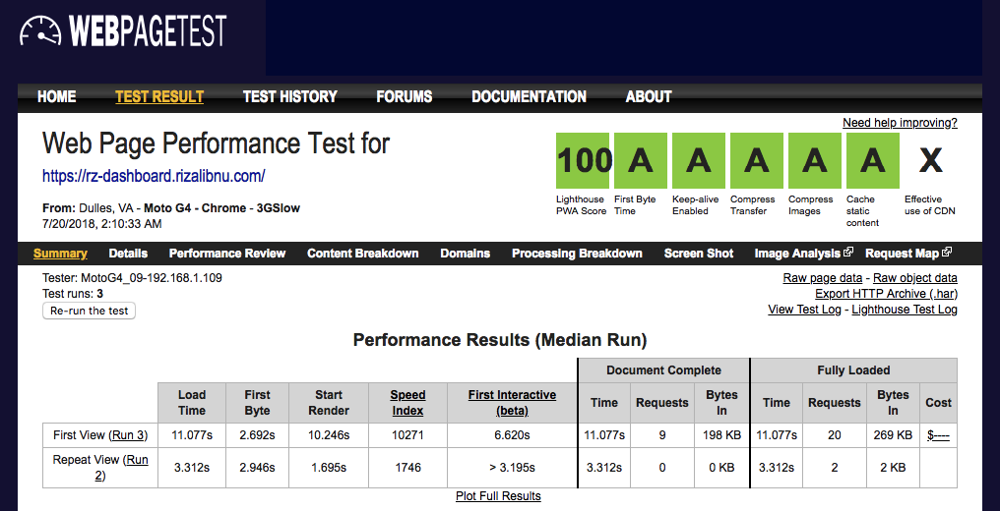

# RZ DASHBOARD
Dashboard Example built with React + Redux + Material UI

This project was bootstrapped with [Create React App](https://github.com/facebookincubator/create-react-app).

Live Preview : https://rz-dashboard.rizalibnu.com/

## Performance Results

### Lighthouse Report

### Webpagetest Report

https://www.webpagetest.org/result/180719_XY_7be2084164c125b56918e2ef4f7e1fb9/

## Admin Features
- [x] User can view list of users
- [x] User can view list of posts of each user
- [x] User can view list of albums of each user
- [x] User can view the detail of each post and its comment
- [x] User can view list of photos from an album
- [x] User can view the detail of photo
- [x] User can add, edit and delete post
- [x] User can add, edit and delete comment

## Web Features
- [x] PWA - Progressive Web Application
- [x] State Management using Redux
- [x] Code Splitting
- [x] Hot Reloading
- [x] CSS in JS
- [x] Offline support. Thanks to service workers.
- [x] Lazy Loading Image
- [x] SEO - Search Engine Optimizations
- [x] Webpack Bundle Analyzer
- [x] Preconnect to other origin
- [x] Prerender Support with Nginx Middleware (Include in Dockerfile)
- [x] Gzip Compression with Nginx (Include in Dockerfile)
- [x] Cache Control with Nginx (Include in Dockerfile)

## Setup

1. Clone the repo
2. `$ cd rz-dashboard`
3. Run `$ yarn` or `npm install`
4. Run locally `$ yarn start` or `npm run start`

## Issues

Feel free to submit issues and enhancement requests.

### License

Released under the MIT License. Check `LICENSE` file for more info.